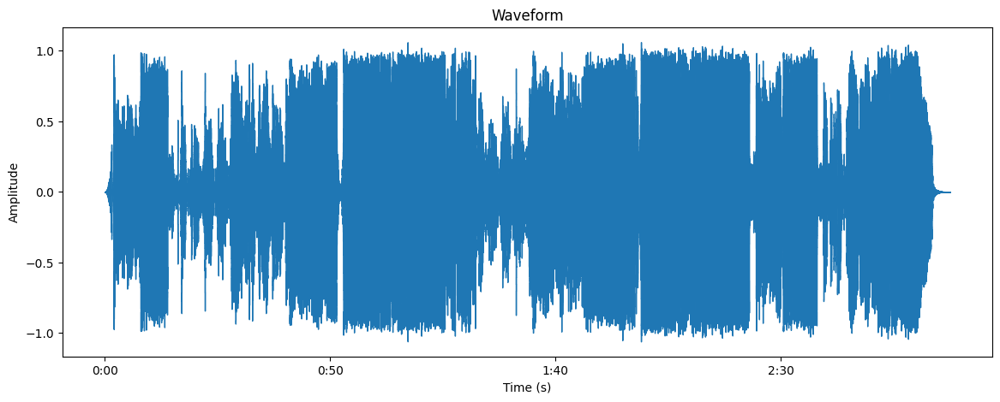
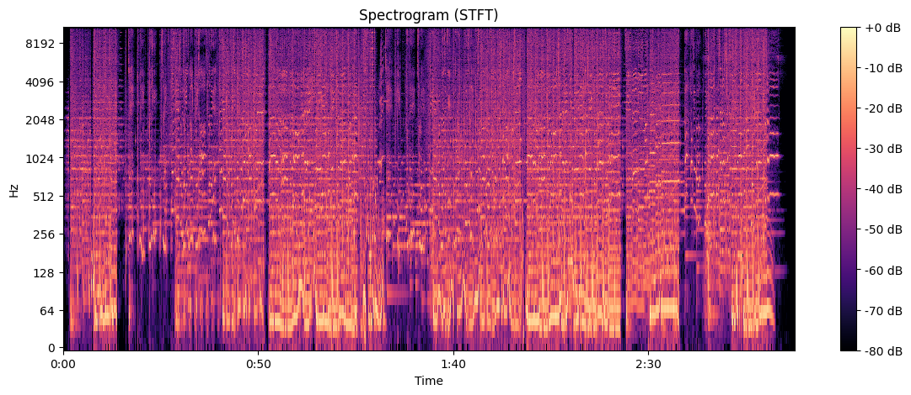

# 实验报告：音频信号处理与分析

## 实验目的
1. 学习如何使用Python中的`librosa`库进行音频文件的读取和处理。
2. 掌握音频波形和频谱图的可视化方法。
3. 了解短时傅里叶变换（STFT）在音频信号处理中的应用。

## 实验环境
- 操作系统：Windows
- 编程语言：Python
- 主要库：`librosa`, `matplotlib`, `numpy`, `IPython`

## 实验步骤

### 1. 导入必要的库
首先，我们导入实验中需要用到的库：
- `librosa`：用于音频文件的读取和处理。
- `matplotlib.pyplot`：用于绘制波形和频谱图。
- `numpy`：用于数值计算。
- `IPython.display`：用于在Jupyter Notebook中播放音频。

```python
import librosa
import librosa.display
import matplotlib.pyplot as plt
import numpy as np
from IPython.display import Audio, display
```

### 2. 读取音频文件
使用`librosa.load()`函数读取音频文件，并获取音频信号`y`和采样率`sr`。

```python
filename = "TruE.wav"
y, sr = librosa.load(filename)
```

### 3. 显示波形
使用`librosa.display.waveshow()`函数绘制音频波形图，并设置图表的标题、横轴和纵轴标签。

```python
plt.figure(figsize=(14, 5))
librosa.display.waveshow(y, sr=sr)
plt.title('Waveform')
plt.xlabel('Time (s)')
plt.ylabel('Amplitude')
plt.show()
```

### 4. 计算并显示频谱图（STFT）
通过`librosa.stft()`函数计算短时傅里叶变换（STFT），并使用`librosa.amplitude_to_db()`将幅度转换为分贝（dB）单位。然后使用`librosa.display.specshow()`函数绘制频谱图。

```python
D = librosa.amplitude_to_db(np.abs(librosa.stft(y)), ref=np.max)
plt.figure(figsize=(14, 5))
librosa.display.specshow(D, sr=sr, x_axis='time', y_axis='log')
plt.colorbar(format='%+2.0f dB')
plt.title('Spectrogram (STFT)')
plt.show()
```

### 5. 播放音频文件
使用`IPython.display.Audio()`函数在Jupyter Notebook中播放音频文件。

```python
display(Audio(filename))
```

## 实验结果

### 1. 波形图
波形图展示了音频信号在时域上的振幅变化。横轴表示时间（秒），纵轴表示振幅。通过波形图，我们可以直观地看到音频信号的强弱变化。



### 2. 频谱图（STFT）
频谱图展示了音频信号在频域上的能量分布。横轴表示时间（秒），纵轴表示频率（对数刻度），颜色表示能量强度（dB）。通过频谱图，我们可以观察到音频信号在不同频率上的能量分布情况。



### 3. 音频播放
通过播放音频文件，我们可以直接听到音频内容，并与波形图和频谱图进行对比，进一步理解音频信号的特征。

<audio controls>
  <source src="TruE.wav" type="audio/wav">
  Your browser does not support the audio element.
</audio>

## 实验总结
通过本次实验，我学习了如何使用`librosa`库对音频文件进行读取、处理和可视化。我掌握了如何绘制音频波形图和频谱图，并了解了短时傅里叶变换（STFT）在音频信号处理中的应用。这些技能对于进一步研究音频信号处理、语音识别等领域具有重要意义。

## 参考文献
- `librosa`官方文档：https://librosa.org/doc/latest/index.html
- `matplotlib`官方文档：https://matplotlib.org/stable/contents.html
- `numpy`官方文档：https://numpy.org/doc/stable/


