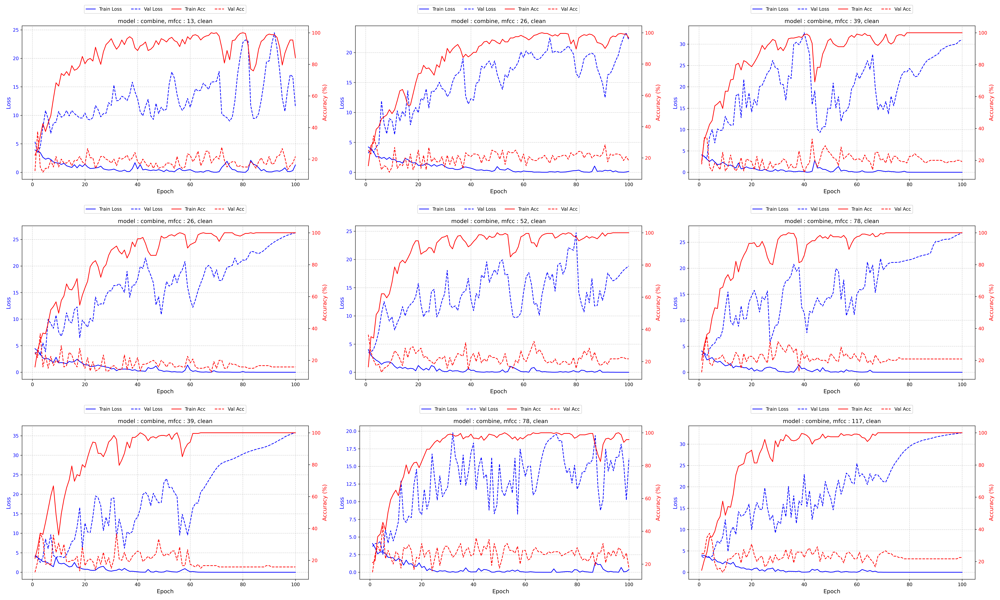
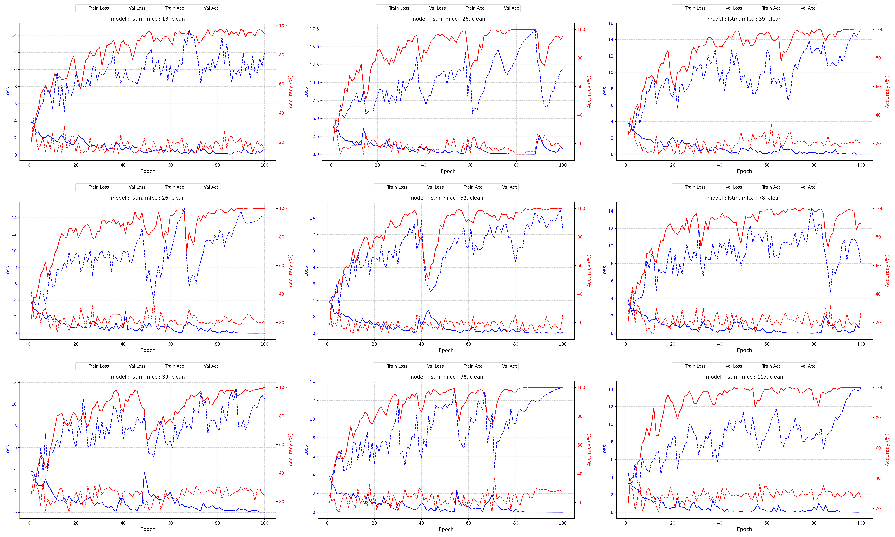
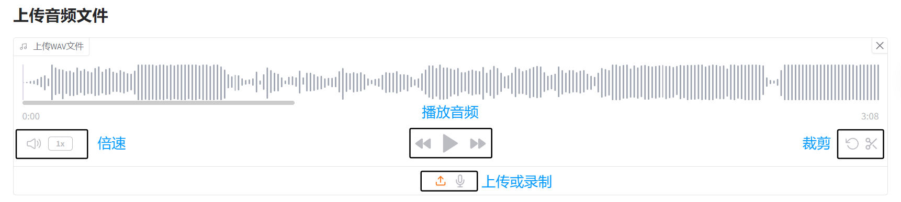
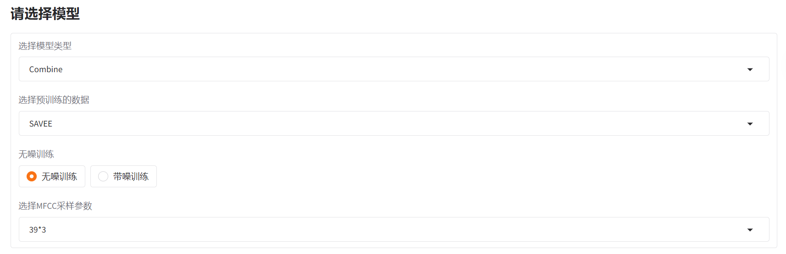

# 语音情感识别系统

## 1. 理论基础

## 2. 数据集

## 3. 特征提取

### 3.1. 静态特征提取

静态特征使用 `opensmile` 工具包，提取了一组综合特征，得到 6373 维向量。

### 3.2. 时序特征提取

提取了 MFCC 系数及其一阶、二阶差分，得到 (117, audio_len) 的矩阵。

### 3.3. 特征存储格式

静态特征保存在 `{speaker}X.csv`

时序特征保存在 `{speaker}T.csv`

语音标签保存在 `{speaker}y.csv`

## 4. 模型构建

### 4.1. RandomForest

使用 `sklearn` 包中的随机森林

### 4.2. MLP

- 可以处理静态特征输入
- 包含三个隐藏层的感知机模型
- 使用 `ReLu` 作为激活函数
- 带有 `Dropout` 和 `LayerNormal` 提升泛化能力
- 输出为 `n` 个类别

### 4.3. LSTM

- 可以处理不定长输入
- 两层双头 LSTM 模型
- 经过一个线性层输出
- 具有 `Dropout` 提高泛化能力
- 输出为 `n` 个类别

### 4.4. Combine Model

结合上述两种方法，将静态特征输入到MLP模型，将时序特征输入到LSTM模型。

通过一个线性层将二者的输出融合。

## 5. 训练与测试

### 5.1. LOSO CV

### 5.2. SAVEE 训练图

### 5.3. EmoDB 训练图

### 5.4. 模型测试

将EmoDB选取 4 个 speaker 作为测试集，这些数据从未在之前的训练中出现过。

测试结果如下：

| trainData | MLP | LSTM | Combine |
| :---: | :---: | :---: | :---: |
| SAVEE | 0.2534 | 0.0769 | 0.1765 |
| EmoDB | 0.2837 | 0.5520 | 0.6109 |

由于测试集是 EmoDB 的子集，这与 EmoDB 上的训练数据分布更加接近。

注：SAVEE 是英语数据集，EmoDB 是德语数据集。

尽管 LSTM 在训练时有着极好的拟合，但是在测试集上不如Combine模型。可以看出 LSTM 更容易过拟合，而简单的多层感知机（MLP）可以有效的降低过拟合风险，因此Combine模型有着更好的泛化表现。

## 6. 用户界面

### 6.1. 基础展示

### 6.2. 功能说明

- 支持上传 `wav` 后缀的音频文件
- 支持实时录音上传
- 支持播放上传或录制的音频
- 支持选择预设的不同模型
- 通过训练好的模型分析输入音频的情感

### 6.3. 情感分析演示

