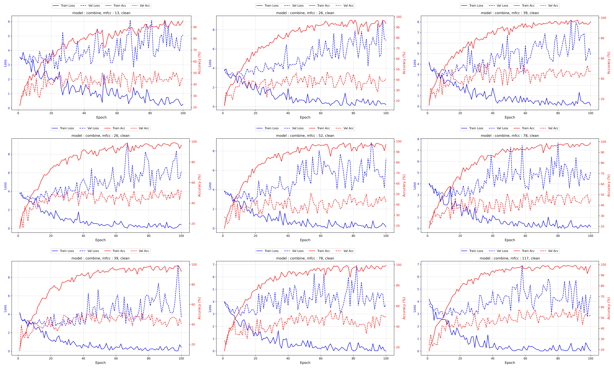
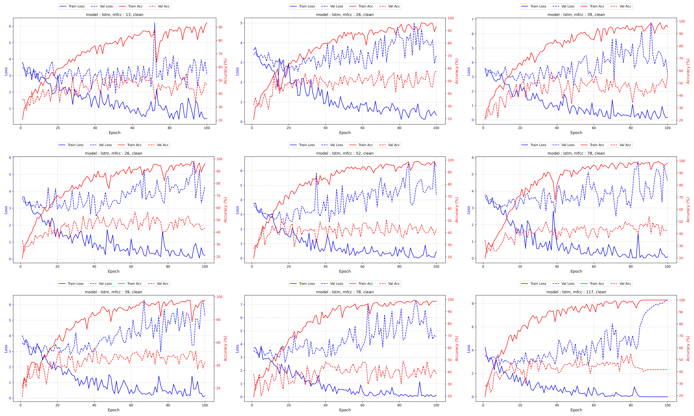

# 语音情感识别系统

## 1. 理论基础

## 2. 数据集

### 2.1. SAVEE


### 2.2. EmoDB


## 3. 特征提取

### 3.1. 静态特征提取

静态特征使用 `opensmile` 工具包，提取了一组综合特征，得到 6373 维向量。

```python
def extract(self, audio_path) -> tuple[pd.DataFrame, str]:
    features = self.smile.process_file(audio_path)
    label = os.path.basename(audio_path).split('_')[0]
    return features, label
```

### 3.2. 时序特征提取

提取了 MFCC 系数及其一阶、二阶差分，得到 (k, audio_len) 的矩阵。

```python
def extract(self, audio_path, delta=1) -> pd.DataFrame:
    y, sr = librosa.load(audio_path, sr=self.sr)
    if delta == 1:
        mfcc = librosa.feature.mfcc(y=y, sr=sr, n_mfcc=self.n_mfcc)
        features = np.array(mfcc)
    if delta == 2:
        mfcc = librosa.feature.mfcc(y=y, sr=sr, n_mfcc=self.n_mfcc)
        delta_mfcc = librosa.feature.delta(mfcc)
        features = np.vstack([mfcc, delta_mfcc])
    if delta == 3:
        mfcc = librosa.feature.mfcc(y=y, sr=sr, n_mfcc=self.n_mfcc)
        delta_mfcc = librosa.feature.delta(mfcc)
        delta2_mfcc = librosa.feature.delta(mfcc, order=2)
        features = np.vstack([mfcc, delta_mfcc, delta2_mfcc])

    return pd.DataFrame(features)
```

### 3.3. 特征存储格式

静态特征保存在 `{speaker}X.csv`

时序特征保存在 `{speaker}T.csv`

语音标签保存在 `{speaker}y.csv`

## 4. 模型构建

### 4.1. RandomForest

使用 `sklearn` 包中的随机森林

### 4.2. MLP

- 可以处理静态特征输入
- 包含三个隐藏层的感知机模型
- 使用 `ReLu` 作为激活函数
- 带有 `Dropout` 和 `LayerNormal` 提升泛化能力
- 输出为 `n` 个类别

```python
class MLP(nn.Module):
    def __init__(self, input_dim=6373, num_classes=8, dropout=0.5):
        super(MLP, self).__init__()
        self.name = 'mlp'
        self.fc1 = nn.Linear(input_dim, 2048)  # 降维
        self.ln1 = nn.LayerNorm(2048)  # 层归一化
        self.relu1 = nn.ReLU()
        self.dropout1 = nn.Dropout(dropout)

        self.fc2 = nn.Linear(2048, 1024)
        self.ln2 = nn.LayerNorm(1024)
        self.relu2 = nn.ReLU()
        self.dropout2 = nn.Dropout(dropout)

        self.fc3 = nn.Linear(1024, 512)
        self.ln3 = nn.LayerNorm(512)
        self.relu3 = nn.ReLU()

        self.fc_out = nn.Linear(512, num_classes)
```

### 4.3. LSTM

- 可以处理不定长输入
- 两层双头 LSTM 模型
- 经过一个线性层输出
- 具有 `Dropout` 提高泛化能力
- 输出为 `n` 个类别

```python
class BiLSTM(nn.Module):
    def __init__(
            self, input_size=117, num_class=8, hidden_size=512,
            num_layers=2, dropout=0.5
    ):
        super().__init__()
        self.name = 'lstm'
        self.lstm = nn.LSTM(
            input_size=input_size,
            hidden_size=hidden_size,
            num_layers=num_layers,
            batch_first=True
        )
        self.fc = nn.Linear(hidden_size, num_class)
        self.dropout = nn.Dropout(dropout)
    def forward(self, t, lengths, *args, **kwargs):
        """
        :param t: 输入张量 (batch_size, max_seq_len, input_dim)
        :param lengths: 每个序列的实际长度 (batch_size,)
        :return output: 分类结果 (batch_size, output_dim)
        """

        packed_input = pack_padded_sequence(
            t, lengths.cpu(), batch_first=True, enforce_sorted=False
        )
        packed_output, (hidden, cell) = self.lstm(packed_input)
        last_hidden = hidden[-1]
        last_hidden = self.dropout(last_hidden)
        output = self.fc(last_hidden)  # (batch_size, output_dim)
        return output
```

### 4.4. Combine Model

结合上述两种方法，将静态特征输入到MLP模型，将时序特征输入到LSTM模型。

通过一个线性层将二者的输出融合。

```python
class CombineModel(nn.Module):
    def __init__(
            self,
            features_dim=6373, temporal_dim=39 * 3,
            num_classes=8, dropout=0.5
    ):
        super(CombineModel, self).__init__()
        self.name = 'combine'
        self.mlp = MLP(features_dim, num_classes, dropout=dropout)
        self.lstm = BiLSTM(temporal_dim, num_classes, dropout=dropout)
        self.attention = nn.Sequential(
            nn.Linear(num_classes * 2, num_classes),
            # nn.Softmax(dim=1)
        )

    def forward(self, x, t, lengths):
        x_feat = self.mlp(x=x)
        t_feat = self.lstm(t=t, lengths=lengths)
        feat_concat = torch.cat([x_feat, t_feat], dim=1)
        attn_weights = self.attention(feat_concat)
        combined = attn_weights * x_feat + (1 - attn_weights) * t_feat 
        return combined
```

## 5. 训练方法

所有训练采用 LOSO CV

### 随机加入噪声

```python
def add_white_noise(audio, noise_level=0.01):
    """添加白噪声"""
    noise = np.random.normal(0, noise_level * np.max(audio), len(audio))
    return audio + noise

def add_pink_noise(audio, noise_level=0.01):
    """添加粉红噪声（1/f噪声）"""
    uneven = noise_level * np.random.randn(len(audio))
    f = np.fft.rfftfreq(len(audio))
    f[0] = 0.001  # 避免除以零
    pink_filter = 1 / np.sqrt(f)
    pink_filter = pink_filter / np.max(pink_filter)
    fft = np.fft.rfft(uneven)
    pink_noise = np.fft.irfft(fft * pink_filter, n=len(audio))
    return audio + pink_noise * np.max(audio) * 0.1

def add_impulse_noise(audio, probability=0.001, strength=0.5):
    """添加脉冲噪声（咔嗒声）"""
    noisy_audio = audio.copy()
    for i in range(len(noisy_audio)):
        if random.random() < probability:
            noisy_audio[i] += strength * (2 * random.random() - 1) * np.max(audio)
    return noisy_audio

def add_harmonic_distortion(audio, distortion_level=0.1):
    """添加谐波失真"""
    return audio + distortion_level * np.sin(2 * np.pi * 1000 * np.arange(len(audio))) / len(audio) * audio
```

每个视频进行10次随机加噪，扩充数据集。

每次加噪完成一下任务：

1. 随机抽取 0~2 种噪声
2. 对抽取到的噪声使用上述代码加噪
3. 保存音频文件

## 6. 训练过程

### 6.1. SAVEE 训练图
#### 融合模型


#### LSTM


### 6.2. Ravdess 训练图

#### 融合模型



#### LSTM



### 6.3. 模型测试 (lstm vs combine)

#### SAVEE clean

| delta | mfcc=13 | mfcc=26 | mfcc=39 |
| :--- | :--- | :--- | :--- |
| 1 | 25.00--25.00 | 25.00--25.00 | 25.83--25.00 |
| 2 | 25.00--25.00 | 25.00--25.83 | 25.00--25.00 |
| 3 | 25.00--30.00 | 25.00--25.83 | 25.00--25.00 |

#### SAVEE noise

| delta | mfcc=13 | mfcc=26 | mfcc=39 |
| :--- | :--- | :--- | :--- |
| 1 | 25.83--30.00 | 25.83--30.00 | 25.83--25.00 |
| 2 | 25.83--30.00 | 25.00--25.83 | 25.83--30.00 |
| 3 | 30.00--30.00 | 25.00--25.83 | 25.00--25.00 |

#### Ravdess clean

| delta | mfcc=13      | mfcc=26      | mfcc=39      |
| :---- | :----------- | :----------- | :----------- |
| 1     | 44.17--43.33 | 35.00--41.67 | 47.50--37.50 |
| 2     | 46.67--35.00 | 38.33--49.17 | 52.50--55.00 |
| 3     | 55.00--57.50 | 35.83--49.17 | 53.33--56.67 |

#### Ravdess noise

| delta | mfcc=13      | mfcc=26      | mfcc=39      |
| :---- | :----------- | :----------- | :----------- |
| 1     | 45.83--45.00 | 37.50--45.83 | 33.33--37.50 |
| 2     | 50.00--38.33 | 45.83--52.50 | 52.50--55.00 |
| 3     | 56.67--60.00 | 44.17--53.33 | 55.00--57.50 |

#### 结论

1. 在lstm的基础上融合一个简单的mlp，有助于提高泛化表现
2. 对数据加入噪声、伸缩时间可以提高模型的泛化能力

## 6. 用户界面

### 6.1. 基础展示


### 6.2. 功能说明

- 支持上传 `wav` 后缀的音频文件
- 支持实时录音上传
- 支持播放上传或录制的音频
- 支持选择预设的不同模型
- 通过训练好的模型分析输入音频的情感

### 6.3. 情感分析演示


### 6.4. 主要代码

```python
class Page(object):
    def __init__(self, model_zoo, tempfile='temp.wav'):
        self.tempfile = tempfile
        self._upload_init()
        self._model_init()
        self._extractor = Evaluator(model_zoo)

    def _upload_init(self):
        gr.Markdown("## 上传音频文件")
        self.audio = gr.Audio(type="filepath", label="上传WAV文件")

    def _model_init(self):
        gr.Markdown('## 请选择模型')
        self.model = gr.Dropdown(
            ["MLP", "LSTM", "Combine"],
            label="选择模型类型",
            value='Combine',
            interactive=True
        )
        self.dataset = gr.Dropdown(
            ["SAVEE"],
            label="选择预训练的数据",
            value='SAVEE',
            interactive=True
        )
        self.mfcc = gr.Dropdown(
            [f'{mfcc * 13}*{delta}'
                for mfcc in range(1, 4)
                for delta in range(1, 4)],
            label='选择MFCC采样参数',
            value=f'39*3',
            interactive=True
        )
        gr.Markdown('## 情感分析结果')
        self.emotion = gr.Markdown('尚未输入语音')
        gr.Button('开始分析').click(
            self.handle,
            inputs=[self.audio, self.model, self.dataset, self.mfcc],
            outputs=[self.emotion],
        )

    def handle(self, audio, model, dataset, mfcc):
        print('uploading...')
        self.upload(audio)
        print('done')
        print('calculating emotion')
        emotion = self.get_emotion(model, dataset, mfcc)
        print('# emotion:', emotion)
        return emotion

    def upload(self, audio):
        shutil.copyfile(audio, self.tempfile)

    def get_emotion(self, model, dataset, mfcc):
        self._extractor.set_model(model, dataset, mfcc)
        emotion = self._extractor(audio=self.tempfile, mfcc=mfcc)
        return str(emotion)
```

## 附录

一些其他脚本和代码

train.sh

```shell
#!/bin/bash

# 参数设置
epoch=100
batchSize=64
mfccs=(13 26 39)
noise=clean
deltas=(1 2 3)
models=("combine" "lstm" "mlp")

for mfcc in "${mfccs[@]}"; do
  for delta in "${deltas[@]}"; do
    dataset="SAVEE_${noise}_${mfcc}_${delta}"

    for model in "${models[@]}"; do
      echo "$dataset $model"

      # 训练模型
      python train.py --dataset "$dataset" --model "$model" \
                     --epoch "$epoch" --batchSize "$batchSize" \
                     --mfcc $((mfcc*delta))

      # 转写
      python translate.py --dataset "$dataset" --model "$model"

      # 绘图
      python plot.py --dataset "$dataset" --model "$model" \
                    --mfcc $((mfcc*delta)) --noise $noise
    done
  done
done
```

extract.sh

```shell
mfccs=(13 26 39)
deltas=(1 2 3)
datasetName="Ravdess"
for mfcc in "${mfccs[@]}"; do
  for delta in "${deltas[@]}"; do
    python extract_features.py --datasetName $datasetName \
                              --mfcc $mfcc --delta $delta
  done
done
```

test.py

```python
def test(
        model, dataset: DataSet,
        batch_size: int = 64
):
    model.eval()

    X, y, T, lengths = dataset.data('test', msg=False)
    test_dataset = TensorDataset(X, y, T, lengths)
    test_loader = DataLoader(test_dataset, batch_size=batch_size, shuffle=False)

    test_correct = 0
    test_total = 0
    with torch.no_grad():
        for x, labels, t, lengths in test_loader:
            outputs = model(x=x, t=t, lengths=lengths)

            _, predicted = torch.max(outputs.data, 1)
            test_total += labels.size(0)
            test_correct += (predicted == labels).sum().item()

    test_acc = test_correct * 100 / test_total

    return test_acc
```

train8val

```python
def run(
        dataloader, model, criterion, optimizer, device,
        options
):
    if options == 'train':
        model.train()
    elif options == 'val':
        model.eval()

    loss, correct, total = 0.0, 0.0, 0.0
    for x, labels, t, lengths in dataloader:
        x, labels = x.to(device), labels.to(device)
        t, lengths = t.to(device), lengths.to(device)

        outputs = model(x=x, t=t, lengths=lengths)
        loss = criterion(outputs, labels)

        if options == 'train':
            # 反向传播和优化
            optimizer.zero_grad()
            loss.backward()
            optimizer.step()

        # 统计
        loss += loss.item()
        _, predicted = torch.max(outputs.data, 1)
        total += labels.size(0)
        correct += (predicted == labels).sum().item()

    return loss, correct * 100 / total
```
