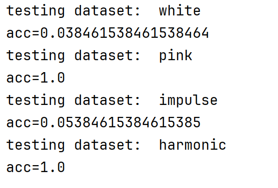

# 基于动态时间规整的孤立字语音识别实验

## 实验目的

1. 掌握语音识别的模板匹配法的原理和过程
2. 掌握DTW技术和MFCC特征提取技术
3. 应用Python实现基于DTW的26个英文字母的识别

## 实验工具

```
pyttsx3
soundfile
librosa
dtw
pandas
numpy
scikit-learn
```

## 实验内容

本实验实现了基于动态时间规整(DTW)和MFCC特征提取的孤立字语音识别系统，针对26个英文字母进行识别。实验内容包括：

1. 语音数据集的生成和处理
2. MFCC特征提取
3. DTW算法实现与优化
4. 在不同噪声条件下的识别性能测试

## 实验过程

### 算法原理描述

1. **MFCC特征提取**：
   - 使用librosa库提取语音信号的MFCC(Mel频率倒谱系数)特征
   - 包含13个倒谱系数，能够有效表征语音的频谱特性

2. **动态时间规整(DTW)**：
   - 解决语音信号时间轴对齐问题
   - 计算测试语音与模板语音MFCC特征之间的最小累积距离
   - 采用欧氏距离作为局部距离度量

3. **模板匹配法**：
   - 为每个字母建立标准语音模板
   - 通过计算测试语音与所有模板的DTW距离进行识别
   - 选择距离最小的模板对应的字母作为识别结果

### 数据集

1. 使用`pyttsx3`引擎生成26个英文字母的标准语音模板，保存为WAV格式
2. 对标准语音添加四种不同类型的噪声：
   - 白噪声(white)
   - 粉红噪声(pink)
   - 脉冲噪声(impulse)
   - 谐波失真(harmonic)

### 算法实现

1. **数据准备**：
   - `Dataset`类负责加载和管理语音文件
   - 支持迭代访问字母标签和对应的文件路径

2. **特征提取**：
   - `extract_mfcc`函数使用librosa提取MFCC特征

3. **DTW计算**：
   - `calculate_dtw`函数实现基于欧氏距离的DTW算法

4. **识别过程**：
   - `recognize_letter`函数完成完整的识别流程
   - 对每个测试语音，计算与所有模板的DTW距离并选择最匹配的

5. **性能评估**：
   - 使用准确率(accuracy)评估系统性能
   - 支持多种噪声条件下的测试

## 实验结果

本次基于动态时间规整(DTW)的孤立字语音识别实验，针对26个英文字母在不同噪声条件下的识别性能进行了测试，得出以下结论：

1. **噪声对识别性能的影响显著**：
   - 在**粉红噪声**和**谐波失真**条件下，系统取得了100%的识别准确率，表明DTW算法对这些类型的噪声具有较强的鲁棒性。
   - 在**白噪声**和**脉冲噪声**条件下，识别准确率分别仅为3.8%和5.4%，说明这两种噪声严重影响了系统的识别性能。

2. **噪声特性分析**：
   - 粉红噪声和谐波失真虽然改变了语音信号的特性，但可能保持了语音的时序结构和频谱特征，使得DTW算法仍能有效匹配。
   - 白噪声和脉冲噪声可能破坏了语音信号的关键特征（如MFCC的时序连续性），导致DTW距离计算失效。

3. **DTW算法的适用性**：
   - 实验验证了DTW算法在特定噪声条件下（如粉红噪声、谐波失真）对孤立字语音识别的有效性。
   - 对于包含白噪声或脉冲噪声的环境，需要进一步优化特征提取方法或结合其他降噪技术。

4. **改进方向**：
   - 可以尝试增加MFCC特征的维度或结合其他特征（如Delta系数）以提高噪声鲁棒性。
   - 对于脉冲噪声，可考虑添加预处理的降噪模块。
   - 进一步优化DTW的路径约束条件，可能提高在复杂噪声环境下的识别率。



